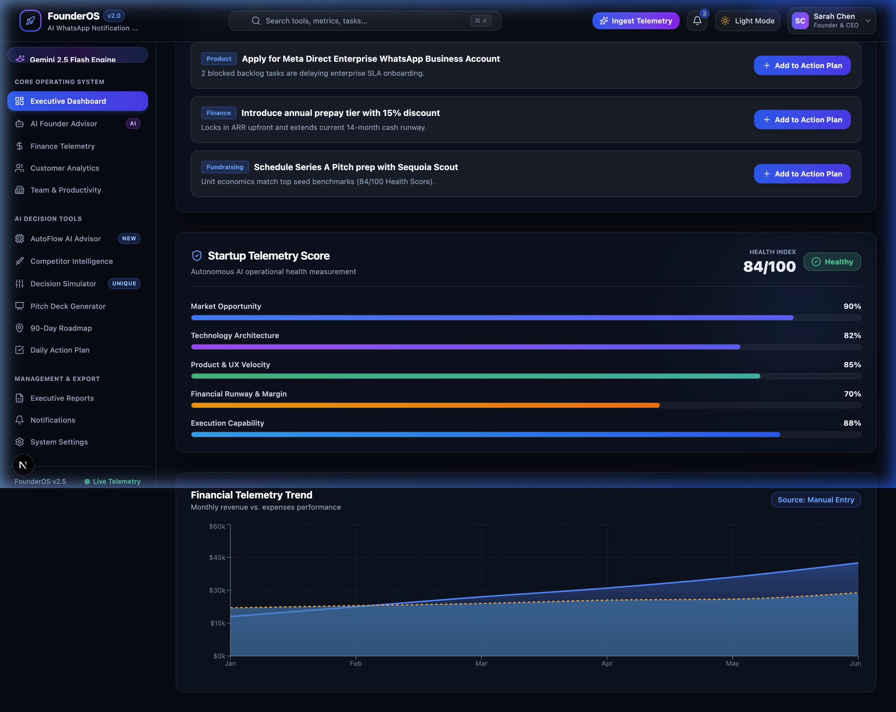
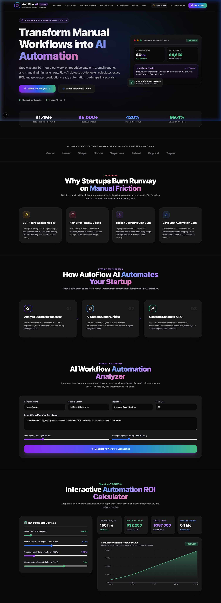
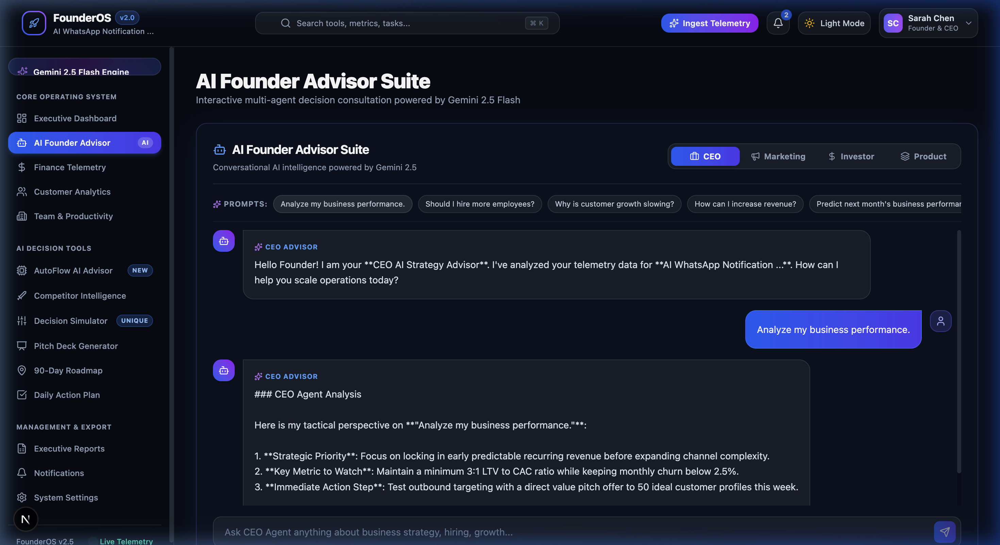

# FounderOS v2.0 & AutoFlow AI 🚀

> **The AI-Powered Operating System & Workflow Automation Engine for SaaS Founders.**

FounderOS is a production-quality executive operating system that connects financial telemetry (MRR, Burn Rate, Cash Runway, Churn) with **Gemini 2.5 Flash AI**, turning live startup metrics into actionable weekly priorities, trade-off simulations, and autonomous workflow blueprints.

---

## 🎬 Live Demo & Interface Screenshots

### 📹 Live Operating Demo


### 📊 Executive Telemetry Dashboard


### ⚡ AutoFlow AI – Workflow Automation Advisor


### 🤖 AI Multi-Agent Advisory Suite


---

## ✨ Key Features & Architecture

### 1. 🎯 AI Weekly Operating Review
- **Focused Hero Top 3 Metrics**: Highlights MRR, Cash Runway, and Primary Risk Alert instantly.
- **Data Provenance & Freshness**: Badges indicating data source (*CSV Import*, *Manual Entry*, *Demo Telemetry*).
- **Data-Grounded AI Diagnostic**: Cites actual financial telemetry numbers (*"MRR grew +14.2% to $42,500..."*) with 1-click *"+ Add to Action Plan"* buttons.

### 2. ⚡ AutoFlow AI – Workflow Automation Suite (`/autoflow`)
- **Interactive AI Workflow Analyzer**: Input company name, industry, team size, department, and current workflow -> Generates automation scores (0-100), bottlenecks, repetitive task breakdowns, and recommended AI stacks (Zapier, Make.com, OpenAI, n8n).
- **Interactive ROI Calculator**: Live sliders for team size, hours spent, and hourly rate with dynamic **Recharts** cumulative capital preserved curves.
- **Before vs After Workflow Architecture**: Side-by-side flow diagrams comparing manual multi-step tasks with autonomous AI pipelines.
- **Automation Opportunity Matrix**: 3x3 Impact vs Effort grid sorting Quick Wins.
- **AI Consultant Chat Suite**: 24/7 interactive advisory agent answering departmental automation queries with live typing animations.

### 3. 🤖 Specialized AI Multi-Agent Suite (`/advisor`)
- **🧠 CEO Agent**: Business Strategy, Unit Economics, and Operational Priorities.
- **📈 Marketing Agent**: Customer Acquisition (CAC), GTM Funnels, and PLG.
- **🎯 Product Agent**: Feature Prioritization (RICE Framework) and 90-Day Roadmaps.
- **💰 Investor Agent**: Venture Capital perspective, Pitch Deck Critiques, and Valuation.
- **📊 Finance & ⚖️ Legal Agents**: Risk Monitoring and Burn Telemetry.

### 4. 🛠️ Real Deliverables & Exports
- **Printable Investor PDF Reports**: 1-click printable PDF memo generator (`/reports`).
- **CSV Data Exports**: Downloadable telemetry datasets.
- **Interactive Task Manager**: Daily action plan with `localStorage` persistence (`/action-plan`).
- **Global Search (`⌘K`)**: Interactive command palette searching tools, metrics, tasks, and routes.

---

## 🛠️ Technology Stack

- **Frontend**: Next.js 15 (App Router), React 19, Tailwind CSS, Framer Motion, Lucide React, Recharts.
- **Backend**: Next.js Server Route Handlers (`/api/analyze`, `/api/agent`, `/api/autoflow`, `/api/simulator`, `/api/pitch`).
- **AI Engine**: Google Gemini 2.5 Flash API (`@google/generative-ai`).
- **Data Parsing & PDF Engine**: Custom CSV parser (`csvParser.ts`) and HTML/Printable PDF generator (`exportUtils.ts`).

---

## 🚀 Getting Started

### 1. Prerequisites
- Node.js 18.x or later installed on your machine.
- Google Gemini API Key (Get one for free at [Google AI Studio](https://aistudio.google.com/)).

### 2. Installation & Setup

```bash
# Clone the repository
git clone https://github.com/Jatinnagarwal5/Founder-OS-project.git

# Navigate to the project folder
cd Founder-OS-project

# Install dependencies
npm install
```

### 3. Configure Environment Variables

Copy the `.env.example` file to `.env.local`:

```bash
cp .env.example .env.local
```

Open `.env.local` and insert your Gemini API Key:

```env
GEMINI_API_KEY=your_actual_gemini_api_key_here
```

### 4. Run the Development Server

```bash
npm run dev
```

Open [http://localhost:3000](http://localhost:3000) in your browser.

### 5. Build for Production

```bash
npm run build
npm run start
```

---

## 📁 Repository Structure

```
Founder-OS-project/
├── public/
│   └── assets/               # Demo WebP recording & frontend screenshots
├── src/
│   ├── app/
│   │   ├── action-plan/      # Interactive Task Manager
│   │   ├── advisor/          # Multi-Agent AI Advisor Suite
│   │   ├── autoflow/         # AutoFlow AI Landing & Interactive Suite
│   │   ├── competitors/      # Competitor Intelligence Dashboard
│   │   ├── dashboard/        # Executive Operating Review Dashboard
│   │   ├── finance/          # Financial Telemetry & Burn Rate Engine
│   │   ├── onboarding/       # 4-Step Telemetry & CSV Onboarding Wizard
│   │   ├── pitch/            # AI Pitch Deck Generator
│   │   ├── reports/          # Downloadable PDF & CSV Reports
│   │   ├── roadmap/          # 90-Day Execution Roadmap
│   │   ├── settings/         # System Settings & Data Provenance
│   │   ├── simulator/        # Strategic Decision Simulator
│   │   └── api/              # Secure Server-Side Gemini API Routes
│   ├── components/
│   │   ├── autoflow/         # AutoFlow AI 20-Section UI Components
│   │   ├── Navbar.tsx        # Top Header with ⌘K Search
│   │   └── Sidebar.tsx       # Navigation Bar
│   ├── context/
│   │   └── StartupContext.tsx# Global State & CSV Telemetry Provider
│   └── lib/
│       ├── csvParser.ts      # CSV Telemetry Ingestion Engine
│       ├── exportUtils.ts    # PDF & CSV Export Utilities
│       └── gemini.ts         # Server-Side Gemini 2.5 Flash SDK Setup
├── .env.example              # Template for environment variables
├── next.config.ts            # Next.js configuration
├── package.json              # Project dependencies
└── README.md                 # Project documentation
```

---

## 📄 License

This project is open-source and available under the MIT License.
